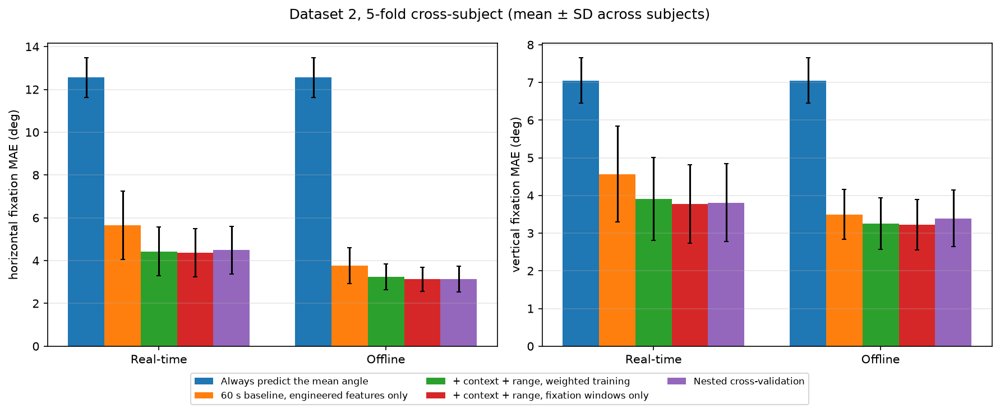

# EOG Gaze Estimation on EyeCon Dataset 2

Estimates horizontal and vertical gaze angle from electrooculography (EOG) on
**EyeCon Dataset 2** (University of Malta, stationary head), for subjects the model has never
seen, and compares the results with the published method of Barbara et al.
(*Biomedical Signal Processing and Control* 86, 2023).

- **Task:** absolute gaze angle, horizontal (H) and vertical (V), in degrees, from 300 ms EOG
  windows.
- **Evaluation:** 5-fold cross-subject; the test subjects are never used for training.
- **Metric:** fixation mean absolute error (MAE), as in the paper, computed per subject and
  reported as mean ± SD over the 10 subjects.

---

## Results at a Glance

**Absolute gaze, subjects never seen in training.** Fixation MAE H / V in degrees:

| Pipeline | Real-time | Offline |
| :--- | :---: | :---: |
| Always predict the training folds' mean angle | 12.56 ± 0.93 / 7.05 ± 0.60 | 12.56 ± 0.93 / 7.05 ± 0.60 |
| 60 s drift baseline, engineered window features only ¹ | 5.65 ± 1.60 / 4.57 ± 1.28 | 3.76 ± 0.84 / 3.50 ± 0.67 |
| + context and rolling-range features, weighted training | 4.43 ± 1.14 / 3.91 ± 1.10 | 3.23 ± 0.60 / 3.26 ± 0.69 |
| + context and rolling-range features, fixation windows only | **4.36 ± 1.12 / 3.78 ± 1.04** | **3.13 ± 0.56 / 3.23 ± 0.67** |
| Settings chosen by nested cross-validation ¹ | 4.49 ± 1.12 / 3.81 ± 1.03 | 3.13 ± 0.60 / 3.39 ± 0.75 |

¹ From the nested cross-validation runs (XGBoost on the GPU); the other rows use the CPU.

- **Real-time vs offline:** real-time uses only past samples; offline centres its drift estimate
  on each window, so it looks ahead.
- **Weighted vs fixation-only training:** weighted training keeps the all-window RMSE low
  (real-time 6.35 / 5.39°, offline 5.25 / 4.53°). Fixation-only training gives the lowest
  fixation MAE but a higher RMSE (7.34 / 5.81°, 6.75 / 5.14°).

**The published task: known start.** The paper starts every segment from the true gaze and
fits each subject separately. The same protocol, replicated here, gives fixation MAE H / V
(same subject, outlier segments dropped):

| Known start | Short segments (1–2 s) | Long segments (32 s) |
| :--- | :---: | :---: |
| This repository: detected saccades | **0.92 ± 0.49 / 1.33 ± 0.24** | 4.21 ± 1.81 / 8.36 ± 3.29 |
| This repository: fused with cross-subject XGBoost | 0.92 ± 0.49 / 1.33 ± 0.24 ² | **3.36 ± 0.85 / 3.38 ± 0.65** |
| Barbara et al. 2023: dual Kalman filter | 1.64 ± 0.82 / 1.97 ± 0.34 | 5.23 ± 2.00 / 6.59 ± 3.10 |
| Barbara et al. 2023: signal differencing | 1.51 ± 0.55 / 1.95 ± 0.29 | 5.82 ± 2.70 / 8.04 ± 2.96 |

² On short segments the fitting chooses no fusion.

**Caveats for the comparison:**
- **Short segments:** a third of the short windows are blink windows, where a rejected blink
  scores 0. On saccade windows alone, detected saccades score 1.75 / 2.09°.
- **Fused estimator:** it uses an XGBoost model trained on the other subjects' labelled
  recordings, which the published filter does not use.
- **Outlier rule:** the paper gives no threshold for its outlier segments, so the rule used here
  (Q3 + 3 × IQR) is a stand-in. It drops 1.6% of short and 4.8% of long segments; the paper
  drops 6.85% and 5.83%.

---

## Dataset

EyeCon Dataset 2 ("Monopolar Stationary"), University of Malta Centre for Biomedical
Cybernetics: https://www.um.edu.mt/cbc/ourprojects/eyecon/eogdataset/

| | |
| :--- | :--- |
| Subjects | 10, head on a chin rest |
| Recording | g.tec g.USBamp, 256 Hz, four monopolar electrodes around the eyes (`EOG_0` … `EOG_3`) |
| Bipolar channels | H = −(`EOG_2` − `EOG_3`), V = `EOG_0` − `EOG_1` (checked with `scripts/verify_montage.py`) |
| Trials | 200 per subject, 4 s each: a cue for 1 s, a second cue for 1 s, then a 2 s blink interval |
| Labels | `ControlSignal` (cue / blink intervals) and per-sample target gaze angles (`TargetGA`) |
| Target range | about ±27° horizontal, ±16° vertical |

Download `Dataset_Stationary.zip` and extract it into `data/raw/Dataset_Stationary/`, which
should then contain `S1/` … `S10/`, each with `EOG.mat`, `ControlSignal.mat` and `TargetGA.mat`.
The data is not part of this repository.

---

## Setup

```bash
python -m venv .venv
.venv\Scripts\activate          # Windows; on Linux/macOS: source .venv/bin/activate
pip install -r requirements.txt  # the versions the results were produced with (Python 3.11)
python scripts/inspect_raw.py    # checks the download and plots one recording
pytest                           # about a minute; the test that needs the data skips without it
```

---

## Reproducing the Results

```bash
# Real-time pipeline (writes reports/realtime_weighted/ and reports/realtime_fixation/)
python main.py --config configs/realtime_weighted.yaml --phase all
python main.py --config configs/realtime_fixation.yaml --phase train
python main.py --config configs/realtime_fixation.yaml --phase compare

# Offline pipeline (reports/offline_weighted/, reports/offline_fixation/)
python main.py --config configs/offline_weighted.yaml --phase all
python main.py --config configs/offline_fixation.yaml --phase train
python main.py --config configs/offline_fixation.yaml --phase compare

# Known-start protocol and its fusion with the cross-subject model
python main.py --config configs/known_start.yaml --phase known_start
python scripts/known_start_fusion.py

# Validation: nested cross-validation (about an hour per track on a GPU) and per-subject statistics
python scripts/nested_cv.py --config configs/realtime_weighted.yaml --track realtime
python scripts/nested_cv.py --config configs/offline_weighted.yaml --track offline
python scripts/subject_statistics.py

python scripts/make_figures.py  # figures in reports/figures/
```

Each results folder holds `baseline_reg_mean.json`, `classical_reg_xgb.json` and
`master_results_table.csv` (the models next to the published numbers). XGBoost on the CPU
(`cv.xgb_device: cpu`, the default) reproduces the committed numbers; the GPU gives slightly
different ones.

---

## Method

1. **Bipolar channels.** H and V from the four electrodes (see Dataset); the monopolar channels
   are kept as extra inputs.
2. **Drift removal.** A robust baseline is fitted to a 60 s sliding window after dropping samples
   more than 3 robust SDs from the window median (blinks):
   - **real-time:** a past-only robust line, evaluated at the current sample;
   - **offline:** a centred robust mean.
3. **Filtering and scaling.** 30 Hz zero-phase low-pass filter; a 50 Hz notch only where the
   spectrum shows mains noise; per-subject z-scoring.
4. **Windows.** 300 ms of H, V and the four monopolar channels, every 150 ms. The target is the
   mean gaze angle over the window. A *fixation window* lies inside one cue interval, starts at
   least 400 ms after the cue and contains no cue change; these are the windows fixation MAE is
   scored on.
5. **Features.**
   - **Engineered window features:** 17 per channel (amplitude, slope, velocity, zero crossings,
     band powers, dominant frequency), plus the H–V correlation and combined RMS.
   - **Context features** (`src/features/context.py`): how three other drift baselines differ
     from the main one, and the signal level 1, 2, 4 and 8 s before the window. A 300 ms window
     cannot show whether its level reflects gaze or baseline error; these can.
   - **Rolling-range features:** over the last 60, 120 and 240 s, and the 10–90% and 5–95%
     quantiles, the window level minus the mid-range, the range, and their ratio. Cues are spread
     over a bounded screen, so the mid-range locates the screen centre precisely, and the range is
     a label-free estimate of the subject's EOG gain.
6. **Model.** XGBoost, one regressor per axis (`src/models/classical_ml.py`). It is trained either
   on all windows with non-fixation windows weighted 0.2, or on fixation windows only.
7. **Evaluation.**
   - **Folds:** 5-fold GroupKFold over subjects.
   - **Fixation MAE:** per subject over fixation windows, then mean ± SD over subjects.
   - **RMSE:** over all windows.

### Known-start protocol

`src/evaluation/known_start.py` replicates the paper's evaluation (Section 4.5.3 and Appendix E).

- **Labels:** fixation, saccade and blink labels come from the EOG.
- **Short segments:** mistake-free 1 s saccade windows and 2 s blink windows, 66 and 33 per third
  of each recording.
- **Long segments:** 32 s segments of 8 trials.
- **Fitting:** parameters are fitted on one third and tested on another (all 6 orderings); an
  "unseen subject" variant fits on the other subjects.
- **Detected saccades:** eye movements detected from the EOG velocity each add their displacement
  through a 2 × 2 linear map, with blinks rejected. This is the paper's signal-differencing
  comparison method.
- **Fused with cross-subject XGBoost** (`scripts/known_start_fusion.py`): detected saccades plus a
  causal low-pass of (XGBoost estimate − saccade estimate). The saccade sum supplies the fast
  changes; the cross-subject model, which never sees the test subject, supplies the slow level.
  The time constant is chosen per axis on the fit data.

---

## Comparison with Barbara et al. 2023

- **The paper's protocol is easier than the main results here.** Its numbers are within-subject:
  every parameter is fitted on the test subject's own data, each segment starts from the known
  gaze, and outlier segments are excluded. The main results in this repository estimate absolute
  gaze for subjects never seen in training, with no known start.
- **On the paper's own protocol:**
  - **Short segments:** summing detected saccades scores below both published methods, helped by
    the blink windows (see the caveats above).
  - **Long segments:** horizontal error is lower than both published methods, but vertical error
    is higher (8.36° vs 6.59°), because blinks the detector misses leave lasting vertical offsets.
  - **Fusion:** fusing with the cross-subject model removes that build-up (3.36 / 3.38°), using
    the other subjects' labelled recordings.
- **Unseen subjects (not in the paper):** 1.11 / 1.77° on short segments; 3.80 / 3.56° on long
  segments with fusion.

---

## Validation

**Nested cross-validation** (`scripts/nested_cv.py`, results in `reports/nested_cv/`).
- **Why:** the settings in `configs/` were chosen by comparing variants on the same test folds the
  results report.
- **How:** nested cross-validation repeats the choice inside each training split. It uses an inner
  4-fold split over the training subjects, and searches 27 combinations: baseline window 30 / 60 /
  120 s × three feature sets × three training-window choices.
- **Result:** every outer fold picked the context and rolling-range features with fixation-only
  training. The nested results (table above) are only 0.02–0.16° above choosing on the test folds.

**Per-subject significance** (`scripts/subject_statistics.py`, `reports/statistics/`). The
nested-CV model is compared with engineered features only, on each subject's fixation MAE, using a
Wilcoxon signed-rank test and a 95% bootstrap confidence interval:

| Track | Mean improvement H / V (deg) | 95% CI H | 95% CI V | Subjects improved H / V | p H / V |
| :--- | :---: | :---: | :---: | :---: | :---: |
| Real-time | 1.17 / 0.76 | 0.51 – 2.00 | 0.52 – 1.01 | 9 / 10 of 10 | 0.010 / 0.002 |
| Offline | 0.64 / 0.11 | 0.37 – 0.89 | −0.13 – 0.31 | 9 / 7 of 10 | 0.004 / 0.19 |

- **Real-time:** the context and range features help on both axes.
- **Offline:** they help significantly only horizontally.



---

## Limitations

- **Few subjects:** 10, so the confidence intervals are wide.
- **Not strictly causal:** the per-subject z-score scale uses the first 10% of each recording, and
  the 30 Hz low-pass filter is zero-phase (a few milliseconds of look-ahead).
- **Gaze that stays off-centre:** a rolling drift baseline cannot tell a gaze offset that lasts as
  long as its window from drift. The pipeline assumes that gaze moves around the screen, as it does
  in this dataset.
- **Known-start replication:** label thresholds come from each whole recording, subject mistakes
  are judged by fixed rules, and the outlier rule is a stand-in. None of these is specified exactly
  in the paper.

---

## Project Structure

```
eog-gaze-dataset2/
├── configs/                 # realtime_{weighted,fixation}.yaml, offline_{weighted,fixation}.yaml, known_start.yaml
├── data/                    # raw/ (download) and processed*/ (generated); not in git
├── main.py                  # phases: inspect, preprocess, train, compare, known_start, all
├── src/
│   ├── config.py            # every tunable parameter
│   ├── data/                # loader, bipolar montage, windowing and fixation flags
│   ├── preprocessing/       # drift removal, filtering, blink detection, z-scoring
│   ├── features/            # engineered, context and rolling-range features
│   ├── models/              # XGBoost and the mean-angle baseline
│   ├── training/            # cross-subject folds
│   └── evaluation/          # metrics, results table, known-start protocol
├── scripts/                 # inspect_raw, verify_montage, known_start_fusion, nested_cv,
│                            # subject_statistics, make_figures
├── tests/                   # pytest suite
└── reports/                 # results JSON/CSV and figures
```

---

## Citation and License

If you use this code, cite the dataset paper:

> N. Barbara, T. A. Camilleri, K. P. Camilleri, "Real-time continuous EOG-based gaze angle
> estimation with baseline drift compensation under stationary head conditions,"
> *Biomedical Signal Processing and Control*, vol. 86, 2023.

- **Code:** MIT License ([`LICENSE`](LICENSE)).
- **Dataset:** remains under its own terms of use.
- **Citing this repository:** see [`CITATION.cff`](CITATION.cff).
